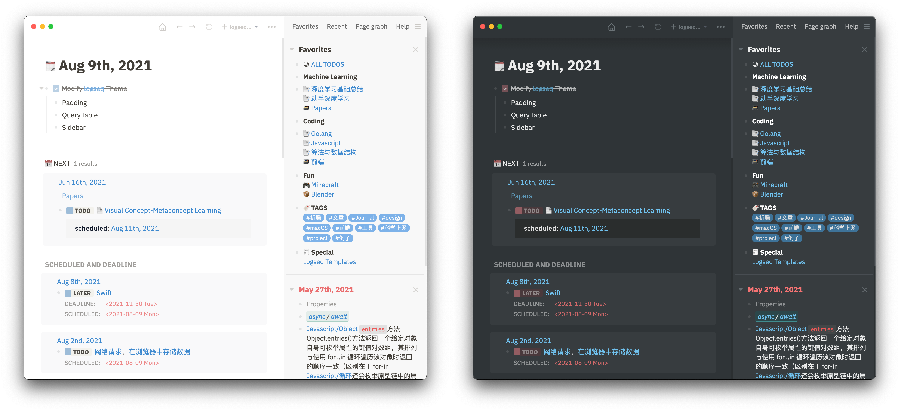
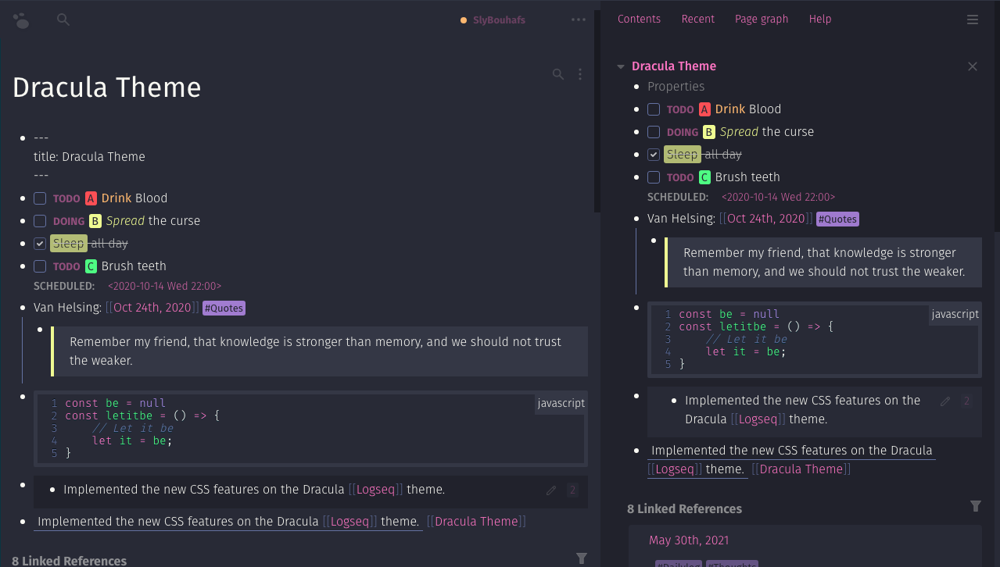

## 介绍

搜集各大佬的[logseq](https://logseq.com)主题，做成插件，方便自己使用

主题版权归属各位大佬，旨在学习Logseq插件制作 & Github版本发布。

## 安装

1. 下载插件ZIP，解压缩到目录（后续不要改变目录）
2. 打开Logseq-设置，开启开发者模式
3. 打开logseq-插件，加载解压后的插件
4. 打开Logseq-主题，选择要使用的主题

#### 主题列表

- [logseq-bonofix-theme](https://github.com/Sansui233/logseq-bonofix-theme)
  
  
- [Dracula for Logseq](https://github.com/dracula/logseq)
  

## 致谢

- 灵感来自[logseq-bonofix-theme](https://github.com/Sansui233/logseq-bonofix-theme)
- 思路来自[插件式多主题安装与切换](https://cn.logseq.com/t/topic/1413)
